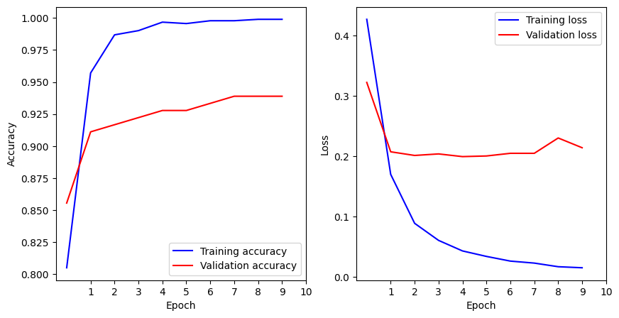
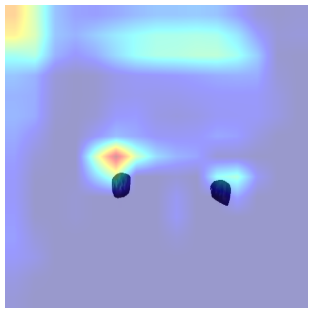
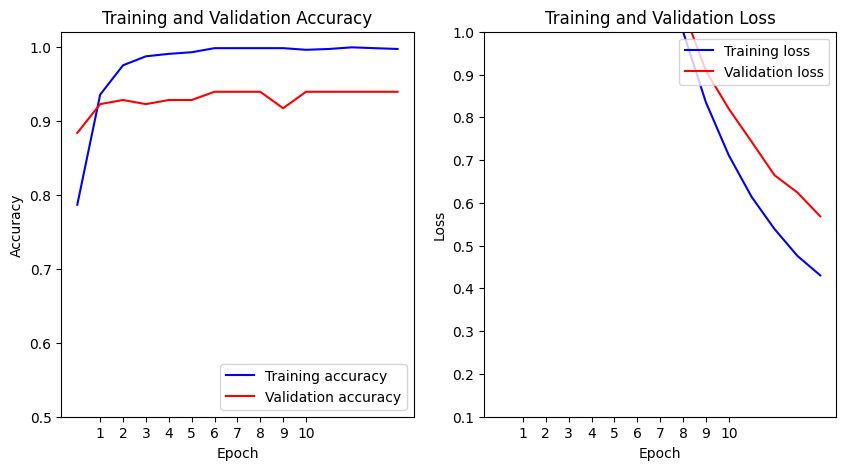
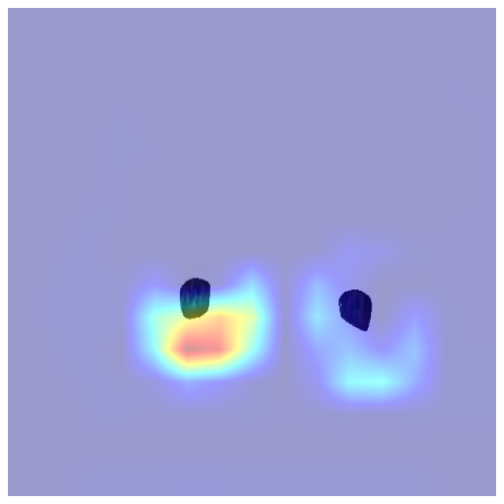
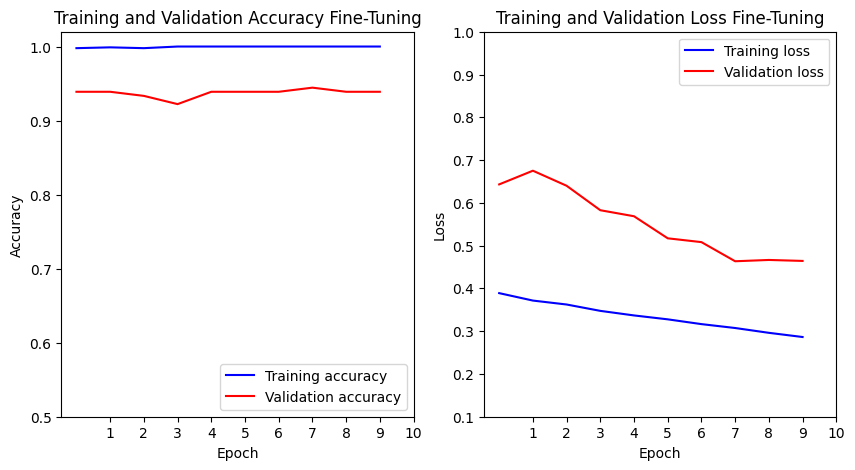
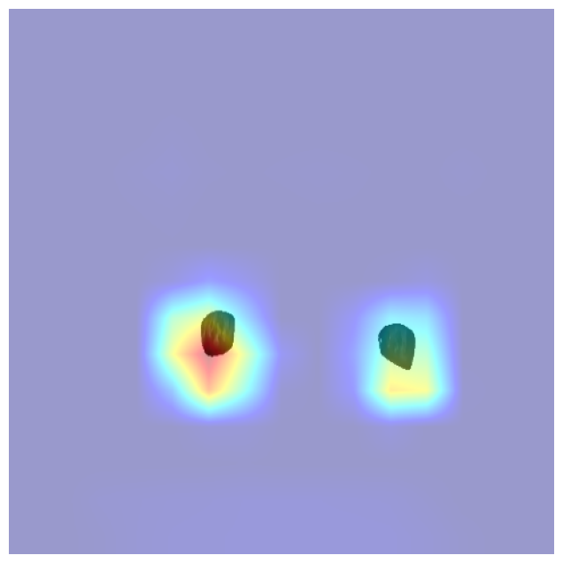

# **Testando o Modelo ResNet-50**

Nesse documento, encontra-se o conteúdo acerca das testagens do modelo ResNet-50 para classificação de imagens.

## **Primeiro Teste**

### Modelagem

**Modelo Base:**
```python
base_model = ResNet50(weights="imagenet", include_top=False, input_shape=(480, 480, 3))

base_model.trainable = False
```

**Camada Superior:**
```python
x = base_model.output
x = GlobalAveragePooling2D()(x)
x = Dense(512, activation="relu", kernel_regularizer=l2(0.01))(x)
x = Dropout(0.5)(x)
output_layer = Dense(2, activation="softmax")(x)
```

**Modelo Final:**
```python
model = Model(inputs=base_model.input, outputs=output_layer)

model.compile(
    optimizer=Adam(learning_rate=0.0001), 
    loss="sparse_categorical_crossentropy", 
    metrics=["accuracy"]
)
```

**Completo:**
```python
# Modelo Base
base_model = ResNet50(weights="imagenet", include_top=False, input_shape=(480, 480, 3))

base_model.trainable = False

# Camada superior
x = base_model.output
x = GlobalAveragePooling2D()(x)
x = Dense(512, activation="relu", kernel_regularizer=l2(0.01))(x)
x = Dropout(0.5)(x)
output_layer = Dense(2, activation="softmax")(x)

model = Model(inputs=base_model.input, outputs=output_layer)

# Compilando
model.compile(
    optimizer=Adam(learning_rate=0.0001), 
    loss="sparse_categorical_crossentropy", 
    metrics=["accuracy"]
)
```

### Treinamento

```python
# Treinando o modelo com os dados de treino e validar com os dados de validação
history = model.fit(
    train_ds,
    validation_data=val_ds,
    epochs=10  
)
```


|    |   accuracy |      loss |   val_accuracy |   val_loss |
|---:|-----------:|----------:|---------------:|-----------:|
|  0 |   0.805066 | 0.4268    |       0.855556 |   0.322229 |
|  1 |   0.957048 | 0.169792  |       0.911111 |   0.207207 |
|  2 |   0.986784 | 0.0886557 |       0.916667 |   0.20116  |
|  3 |   0.990088 | 0.0603779 |       0.922222 |   0.203695 |
|  4 |   0.996696 | 0.0428907 |       0.927778 |   0.199241 |
|  5 |   0.995595 | 0.0338027 |       0.927778 |   0.200289 |
|  6 |   0.997797 | 0.0260448 |       0.933333 |   0.204704 |
|  7 |   0.997797 | 0.0227316 |       0.938889 |   0.204688 |
|  8 |   0.998899 | 0.0167188 |       0.938889 |   0.230109 |
|  9 |   0.998899 | 0.0149863 |       0.938889 |   0.213935 |

### Validação com Teste

```python
test_loss, test_acc = model.evaluate(test_ds)
print(f"Acurácia no conjunto de teste: {test_acc * 100:.2f}%")
```
`11/11 ━━━━━━━━━━━━━━━━━━━━ 9s 846ms/step - accuracy: 0.3737 - loss: 1.5854`

Acurácia no conjunto de teste: $64.57\%$

**Gradcam:**



---

## **Segundo Teste**

No segundo teste, vou aplicar métodos para evitar overfitting e melhorar a generalização da seguinte forma:
- Adicionando penalizadores 
- Reajustando a arquitetura
- Diminuindo taxa de aprendizagem
- Fine Tuning

### **Modelo SEM Fine-Tuning**

### Modelagem

**Módulos:**
```python
import tensorflow as tf
import numpy as np
import cv2
import matplotlib.pyplot as plt
from tensorflow.keras.applications import ResNet50
from tensorflow.keras.models import Model
from tensorflow.keras.layers import Dense, Dropout, GlobalAveragePooling2D
from tensorflow.keras.optimizers import Adam
from tensorflow.keras.regularizers import l2
from tensorflow.keras.callbacks import ReduceLROnPlateau
from tensorflow.keras.preprocessing import image_dataset_from_directory
```

**Modelo Base:**
```python
base_model = ResNet50(weights="imagenet", include_top=False, input_shape=(480, 480, 3))
base_model.trainable = False 
```

**Camada Superior:**
```python
x = base_model.output
x = GlobalAveragePooling2D()(x)
x = Dense(512, activation="relu", kernel_regularizer=l2(0.01))(x)  # Regularização L2
x = Dropout(0.5)(x)
output_layer = Dense(2, activation="softmax")(x)
```

**Modelo Final:**
```python
model = Model(inputs=base_model.input, outputs=output_layer)

model.compile(optimizer=Adam(learning_rate=0.0001), loss="sparse_categorical_crossentropy", metrics=["accuracy"])
```

**Completo:**
```python
base_model = ResNet50(weights="imagenet", include_top=False, input_shape=(480, 480, 3))
base_model.trainable = False 

x = base_model.output
x = GlobalAveragePooling2D()(x)
x = Dense(512, activation="relu", kernel_regularizer=l2(0.01))(x)  # Regularização L2
x = Dropout(0.5)(x)
output_layer = Dense(2, activation="softmax")(x)

model = Model(inputs=base_model.input, outputs=output_layer)

model.compile(optimizer=Adam(learning_rate=0.0001), loss="sparse_categorical_crossentropy", metrics=["accuracy"])
```

### Treinamento

```python
# Callback para reduzir a taxa de aprendizado automaticamente
lr_scheduler = ReduceLROnPlateau(monitor="val_loss", factor=0.5, patience=3, verbose=1)

history = model.fit(train_ds, validation_data=val_ds, epochs=15, callbacks=[lr_scheduler])
```


|    |   accuracy |     loss |   val_accuracy |   val_loss |   learning_rate |
|---:|-----------:|---------:|---------------:|-----------:|----------------:|
|  0 |   0.786344 | 7.66283  |       0.883333 |   6.52977  |          0.0001 |
|  1 |   0.935022 | 5.66489  |       0.922222 |   4.95051  |          0.0001 |
|  2 |   0.97467  | 4.26733  |       0.927778 |   3.7962   |          0.0001 |
|  3 |   0.986784 | 3.24993  |       0.922222 |   2.93257  |          0.0001 |
|  4 |   0.990088 | 2.48994  |       0.927778 |   2.3087   |          0.0001 |
|  5 |   0.992291 | 1.93818  |       0.927778 |   1.84245  |          0.0001 |
|  6 |   0.997797 | 1.5242   |       0.938889 |   1.50236  |          0.0001 |
|  7 |   0.997797 | 1.22271  |       0.938889 |   1.24341  |          0.0001 |
|  8 |   0.997797 | 1.00043  |       0.938889 |   1.05268  |          0.0001 |
|  9 |   0.997797 | 0.835094 |       0.916667 |   0.908606 |          0.0001 |
| 10 |   0.995595 | 0.711198 |       0.938889 |   0.820028 |          0.0001 |
| 11 |   0.996696 | 0.613841 |       0.938889 |   0.742791 |          0.0001 |
| 12 |   0.998899 | 0.538765 |       0.938889 |   0.664574 |          0.0001 |
| 13 |   0.997797 | 0.476076 |       0.938889 |   0.624237 |          0.0001 |
| 14 |   0.996696 | 0.430458 |       0.938889 |   0.568388 |          0.0001 |


### Validação com Teste

```python
test_loss, test_acc = model.evaluate(test_ds)
print(f"Acurácia no conjunto de teste com regularização e sem fine-tuning: {test_acc * 100:.2f}%")
```
`11/11 ━━━━━━━━━━━━━━━━━━━━ 3s 316ms/step - accuracy: 0.3493 - loss: 1.8019`

Acurácia no conjunto de teste com regularização e sem fine-tuning: $62.29\%$

**GradCam:**



---

### **Modelo COM Fine-Tuning**

A modelagem base permanece a mesma.

**Modelo Final:**
```python
# Modelo para fine-tuning
model_finetuning = Model(inputs=base_model.input, outputs=output_layer)

# Deixar treináveis as 10 últimas camadas
for layer in base_model.layers[-10:]:
    layer.trainable = True

# Compilado com taxa de aprendizado menor
model_finetuning.compile(optimizer=Adam(learning_rate=0.00001), loss="sparse_categorical_crossentropy", metrics=["accuracy"])

# Treino
history_finetune = model_finetuning.fit(train_ds, validation_data=val_ds, epochs=10, callbacks=[lr_scheduler])
```

**Completo:**
```python
base_model = ResNet50(weights="imagenet", include_top=False, input_shape=(480, 480, 3))
base_model.trainable = False

x = base_model.output
x = GlobalAveragePooling2D()(x)
x = Dense(512, activation="relu", kernel_regularizer=l2(0.01))(x)  # Regularização L2
x = Dropout(0.5)(x)
output_layer = Dense(2, activation="softmax")(x)

model_finetuning = Model(inputs=base_model.input, outputs=output_layer)

for layer in base_model.layers[-10:]:
    layer.trainable = True

model_finetuning.compile(optimizer=Adam(learning_rate=0.00001), loss="sparse_categorical_crossentropy", metrics=["accuracy"])
```

### Treinamento

```python
history_finetune = model_finetuning.fit(train_ds, validation_data=val_ds, epochs=10, callbacks=[lr_scheduler])
```


|    |   accuracy |     loss |   val_accuracy |   val_loss |   learning_rate |
|---:|-----------:|---------:|---------------:|-----------:|----------------:|
|  0 |   0.997797 | 0.388907 |       0.938889 |   0.643104 |           1e-05 |
|  1 |   0.998899 | 0.371528 |       0.938889 |   0.675099 |           1e-05 |
|  2 |   0.997797 | 0.362334 |       0.933333 |   0.639913 |           1e-05 |
|  3 |   1        | 0.347455 |       0.922222 |   0.582716 |           1e-05 |
|  4 |   1        | 0.336777 |       0.938889 |   0.568633 |           1e-05 |
|  5 |   1        | 0.327655 |       0.938889 |   0.517056 |           1e-05 |
|  6 |   1        | 0.316483 |       0.938889 |   0.508146 |           1e-05 |
|  7 |   1        | 0.307381 |       0.944444 |   0.46344  |           1e-05 |
|  8 |   1        | 0.296128 |       0.938889 |   0.466465 |           1e-05 |
|  9 |   1        | 0.28635  |       0.938889 |   0.464206 |           1e-05 |


### Validação com Teste

```python
test_loss, test_acc = model_finetuning.evaluate(test_ds)
print(f"Acurácia no conjunto de teste: {test_acc * 100:.2f}%")
```
`11/11 ━━━━━━━━━━━━━━━━━━━━ 3s 303ms/step - accuracy: 0.4709 - loss: 2.0168`

Acurácia no conjunto de teste com Fine-Tuning: $72.57\%$

**GradCam:**



